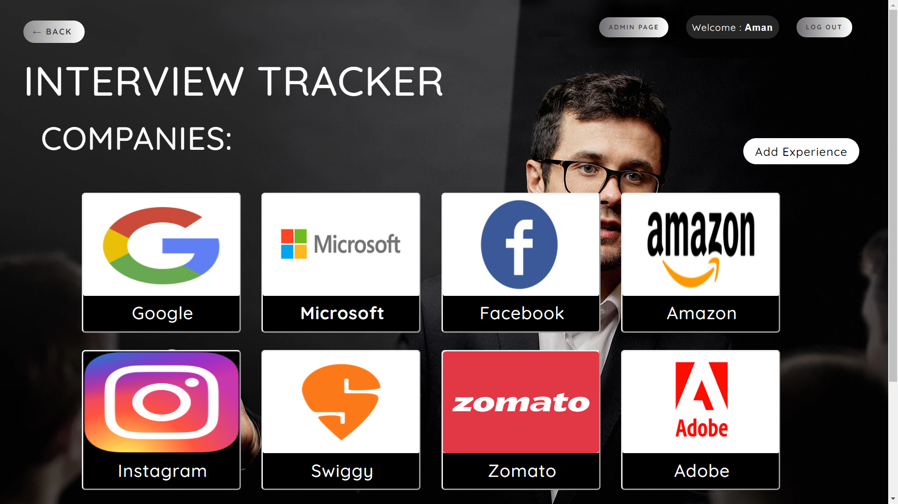

# Interview Tracker Website

In this project where we built centralized solution for interview preparation.
 1) Most of the students face huge difficulties during interview preparation as all the essential materials for preparation are not present in single website.
 2) So we came up with an awesome website where you can find all the great and important coding questions.
 3) Here you can also see the experience shared by the students who have qualified the interview.

**Setting up:**
 1) Install node.js
 2) Set up mongo server
 3) Install all the dependancies using command "npm install"
 4) Run the site using command "nodemon app" and visit the website on "http://localhost:3000/"

Some of the packages/dependencies used in developing this website are :
 1) [Admin-Bro](https://adminbro.com/section-modules.html)
 2) [Express](http://expressjs.com/)
 3) [Mongoose](https://mongoosejs.com/docs/)
 4) [Nodemon](https://nodemon.io/)

**Login/Signup page:  ** 
  The user get directed to the Login page. If the user doesn't have an account then he/she can visit the signup page and create a new account.

**Home page:  **
  After login/signup the user is directed to the home page  
 
 
 **The home page contains 2 sections:**
 1) Coding Section
 2) Interview Expereince Section

**Coding Section**
 1) The main component for interview prepapration is the coding round which requires a lot of practice.
 2) The website has various topics and questions enlisted in it for topic wise practice.
 3) Questions have been well classified in different Topics.
 4) On clicking on the "**View Topics**" button, all the topics will be shown.

 &nbsp; &nbsp; **Coding topics:**  
    &nbsp; &nbsp; &nbsp; 1) Questions have been well classified in different Topics.  
    &nbsp; &nbsp; &nbsp; 2) On clicking on the "**topic's name**", the questions related to that particular topic will be shown. 
   
   
 &nbsp; &nbsp; **Coding Questions:**  
    &nbsp; &nbsp; &nbsp; 1) In this page, questions related to that particular topic are displayed.  
    &nbsp; &nbsp; &nbsp; 2) Another adventage is that Questions from different sources and platforms are present. 
   

 &nbsp; &nbsp; **Adding Question:**  
    &nbsp; &nbsp; &nbsp; 1) In the Topics Page, the user can add question of different topics.  
    &nbsp; &nbsp; &nbsp; 2) The user can add a whole new topic if the topic is not present.
   
   
**Interview Expereince Section**
 1) On clicking on the "**View Experience**" button, the user will be directed to the experience section of the page.

 &nbsp; &nbsp; **Companies:**  
    &nbsp; &nbsp; &nbsp; 1) This section contains list of companies that have recruited from different colleges across the country.  
    &nbsp; &nbsp; &nbsp; 2) On clicking on the "**Company's name**" , the user will be directed to page containing experience of different students who qualified the 
    &nbsp; &nbsp; &nbsp; &nbsp; interview of that  company. 
   
   
 &nbsp; &nbsp; **Experiences:**  
    &nbsp; &nbsp; &nbsp; 1) This page contains experience of different students who qualified the interview of that company.  
    &nbsp; &nbsp; &nbsp; 2) On clicking on "**Read More**" button, the full experience of that students will be displayed.
    

 &nbsp; &nbsp; **Add Experience:**  
    &nbsp; &nbsp; &nbsp; 1) In the Companies Page, the user can add Interview Experience.  
    &nbsp; &nbsp; &nbsp; 2) The user can also add a whole new company if it is not present already along with company's logo link.
    
    
**Admin Page Login**
  1) One the Home Page, there is a "**Admin Page**" button which is visible to the admins only.
  2) On clicking on the "**Admin Page**" button, the user gets directed to the login page for the Admin.
  
  
**Admin Page**
  1) If the user is an admin then he/she will be able able to login to the Admin page.
  2) Through this, the Admins can access the data in the database and can also decide whether a particular data will be shown or not.
   
   
    
   
 # &nbsp; &nbsp; &nbsp; &nbsp; &nbsp; &nbsp;&nbsp; &nbsp; &nbsp; &nbsp; &nbsp; Thank you for going through our website
 
 # Contributers 
  1) **Aman Kumar**
  2) **Aakash Solanki**
  3) **Yashwardhan Modi**
  4) **Yogesh Sahota**
 
 
